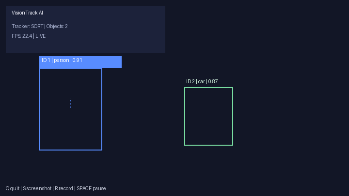

# CodeAlpha — Object Detection and Tracking

**VisionTrack AI** is a real-time computer vision application that detects objects with **YOLOv8** and tracks them across video frames using **SORT** (with optional **DeepSORT** fallback integration).

## Demo



*Live overlay with track IDs, class labels, motion trails, and HUD metrics.*

### Create or update the demo GIF

After you record a session (`R` while running) or process a sample video:

```bash
# From latest recording in output/
python scripts/create_demo_gif.py

# From a specific video
python scripts/create_demo_gif.py --video output/tracked_YYYYMMDD_HHMMSS.mp4

# Synthetic preview (no recording needed)
python scripts/create_demo_gif.py --synthetic
```

Requires `imageio` or `Pillow` (`pip install imageio pillow`).

## Features

### Core requirements

- Real-time input from **webcam** or **video file** (OpenCV)
- Pre-trained **YOLO** object detection (Ultralytics YOLOv8)
- Per-frame detection with **bounding boxes**
- Multi-object tracking with **SORT** (+ DeepSORT when installed)
- Live display with **class labels** and **tracking IDs**

### Beyond requirements

- **Dual trackers:** SORT (default) and DeepSORT (`--tracker deepsort`)
- **Multiple YOLO sizes:** `yolov8n.pt`, `yolov8s.pt`, `yolov8m.pt`
- **Live confidence / IOU sliders** (OpenCV trackbars)
- **Motion trails** for each track ID
- **FPS + object count HUD**
- **Class filtering** (`--classes person car`)
- **Screenshot** (`S` key)
- **Video recording** (`R` key) to `output/`
- **Pause/resume** (`SPACE`)
- **CSV tracking logs** in `output/logs/`
- Color-coded boxes per track ID

## Project Structure

```text
CodeAlpha_Object Detection and Tracking/
├── app.py
├── config.py
├── detector.py
├── requirements.txt
├── tracking/
│   ├── sort_tracker.py
│   └── deepsort_tracker.py
├── utils/
│   └── visualization.py
├── assets/
│   └── demo.gif
├── scripts/
│   └── create_demo_gif.py
├── output/
├── samples/
└── README.md
```

## Setup

```bash
cd "CodeAlpha_Object Detection and Tracking"
python3 -m venv .venv
source .venv/bin/activate
pip install -r requirements.txt
```

On first run, YOLOv8 weights download automatically (e.g. `yolov8n.pt`).

## Usage

### Webcam (default camera)

```bash
python app.py --source 0
```

### Video file

```bash
python app.py --source samples/demo.mp4
```

### DeepSORT tracker

```bash
python app.py --source 0 --tracker deepsort
```

### Filter classes + larger model

```bash
python app.py --source 0 --model yolov8s.pt --classes person car dog
```

### Start recording immediately

```bash
python app.py --source 0 --record
```

## Keyboard Controls

| Key | Action |
|-----|--------|
| `Q` / `Esc` | Quit |
| `SPACE` | Pause / resume |
| `S` | Save screenshot |
| `R` | Toggle video recording |

## How It Works

1. **Detection:** Each frame is passed to YOLOv8, producing bounding boxes, class names, and confidence scores.
2. **Tracking:** Detections are fed into SORT (Kalman filter + Hungarian assignment) to maintain stable IDs across frames.
3. **Visualization:** Boxes, labels, IDs, trails, and HUD metrics are rendered in real time.

## Configuration

Edit `config.py` for defaults:

- `MODEL_NAME`, `CONFIDENCE_THRESHOLD`, `IOU_THRESHOLD`
- `TRACKER_TYPE`, `MAX_AGE`, `MIN_HITS`
- `TRAIL_LENGTH`, `ALLOWED_CLASSES`

## Outputs

- Annotated recordings: `output/tracked_*.mp4`
- Screenshots: `output/capture_*.jpg`
- Tracking logs: `output/logs/tracks_*.csv`

## Known Limitations

- Performance depends on hardware (GPU recommended for larger models).
- DeepSORT requires `deep-sort-realtime`; otherwise SORT is used automatically.
- Very crowded scenes may experience ID switches (common in online trackers).

## Future Improvements

- Web dashboard with live MJPEG stream
- Re-ID embeddings fine-tuned for domain-specific scenes
- Zone-based counting and line-crossing analytics
- ONNX/TensorRT export for edge deployment
